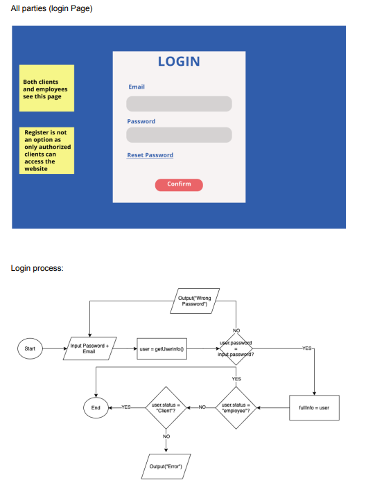
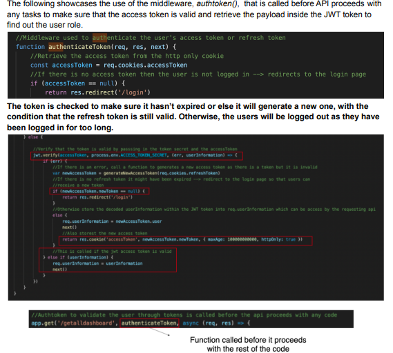

# B2B-E-Commerce-Web-Application-Full-Stack

This one of my largest project which is a B2B E-commerce web application with finance, logistics, and inventory management components. The aim of the web application is to accelerate communication process between various departments and the clients who typically purchase large bulk of products. 

Some of the features included: 
- User side / Employee side (logistics, finance, and general admin)
- Users can view and place orders (cart system, product filter and search, invoice, records management, image upload)
- Admins and employees can process, reject, accept, and manipulate product catalogue (edit, delete, add)
- Full authentication and authorisation system, utilising JWT token
- emailing system for invoice + automatic invoice generation

A full demonstration video of the web appliction can be found by the video below: 

## Design 

Once I established the general scope of the problem, I began drafting a requirements definition (can be found in design.pdf)

### Page Flow 

Clients:

Employees: 

### System Flowchart

Flowchart for users: 

Flowchart for employees: 

### Some of the database designs: 

ER Diagram: 

Cart and variant - normalised: 

Transaction Database: 

### Some User Interface Designs and Flow Chart

Login process: 

Delivery page: 

Product page: 

## Implementation 

### Authentication and User Validation 

To ensure that only valid users can use the web app, JWT token is a method used to verify and aunthenticate credentials. The token is also stored in the cookie and users don't have to relogin everytime. 

The JWT token will be stored in HTTP only cookie as opposed to a front-end session or local storage in the browser as it supports back-end validation and authentication of users. This prevents the possibility of a cross-site scripting (xss) attack which allows attackers to retrieve any data stored in the front-end local storage by running a malicious javascript code. Server-side sessions such as HTTP only cookie are suitable for storing JWT tokens as they are impossible to be accessed through front-end javascript due to its settings.

For info on how this is implemented can be found in 

